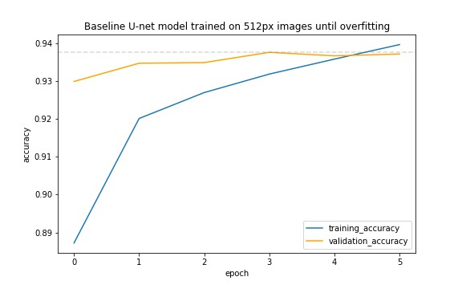
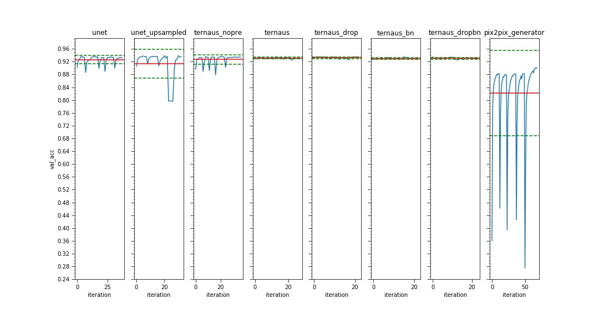
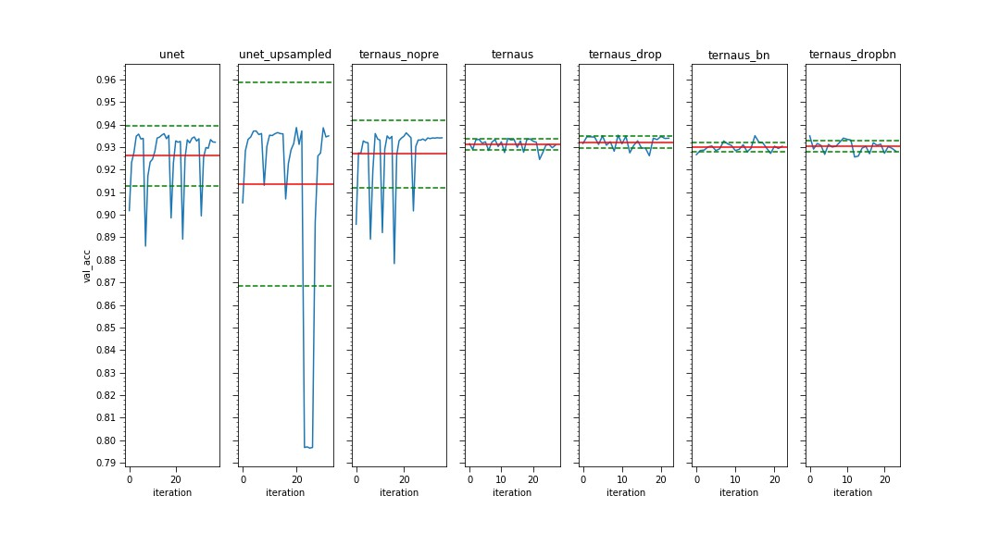

# U-Nets: A segment space odyssey


This repo implements and compares three U-Net architectures trained on the [ISBI Challenge](http://brainiac2.mit.edu/isbi_challenge/) dataset. The following architectures are included:

- **U-Net**: The original implementation as described in [1]
- **TernausNet**: A pre-trained variation on the above as described in [2]
- **Pix2Pix generator**: The generator architecture used in pix2pix GAN as described in [3]

All models are implemented in Keras/Tensorflow and are trained on the same dataset of neuronal structure images used in the original U-Net paper. Example input images (left) and target output images (right) are shown in the animation above. This dataset is tiny containing only 30 training samples, and 30 test samples.

## Questions

Experiments are designed to answer the following questions:

1. Does upsampling with transposed-convolutional layers improve performance over nearest-neighbour upsampling?
1. Does using pre-trained VGG network as encoder improve performance?
1. Does TernausNet benefit from addition of dropout per orginal U-Net?
1. Does TernausNet benefit from batch normalisation in decoder?


## Experiment A – Baseline

Before comparing architectures we set a baseline by reproducing the original U-Net experiment (Table 1. in [1]). The U-Net architecture is trained as described in [1] with a few simplifications:

- Loss function is binary-cross-entropy loss without soft-max component
- Weight map that incurs greater loss for pixels between cell borders is omitted
- Data augmentation: use shear to warp images instead of "random elastic deformations" described in paper



The model achieves a validation set pixel accuracy of 0.9376 which equates to a pixel error of 0.0624. This is similar to the original paper's result of 0.0611 pixel error.

## Experiment B – Comparison of architectures

Now that we know our baseline U-Net experiment is roughly equivalent to the original paper, we can vary model architectures within the same experimental method to compare performance.

Comparison of validation-set pixel accuracy for each model after 20 epochs each of 250 training steps. Each experiment is repeated 20 times (iterations) to allow estimate of mean and variance of model performance.



Same as above but without pix2pix results to allow fine-grained comparison on a reduced scale.



Tabulated results from plots above.

| model | parameters | mean validation acc. | std validation acc. |
| --- | --- | --- | --- |
| unet             | 31,031,685 | 0.9261 | 0.0132 | 
| unet_upsampled   | 31,031,685 | 0.9136 | 0.0452 |
| ternaus_nopre    | 28,470,791 | 0.927  | 0.0149 |
| ternaus 	       | 28,467,719 | 0.9312 | 0.0024 |
| ternaus_drop 	   | 28,470,791 | 0.9322 | 0.0026 |
| ternaus_bn 	   | 28,495,879 | 0.93   | 0.0019 |
| ternaus_dropbn   | 28,495,879 | 0.9302 | 0.0025 |
| pix2pix 	       | 54,417,665 | 0.8218 | 0.1331 |


Disambiguation of model names:
- **unet**: as described in original paper [1]
- **unet_upsampled**: as above but with bilinear upsampling instead of transposed convolutions in decoder
- **ternaus_nopre**: TernausNet architecture without pretrained weights
- **ternaus**: TernausNet with pretrained weights from ImageNet
- **ternaus_drop**: As `ternaus`, with dropout added after final two layers of the encoder, as per `unet` 
- **ternaus_bn**: As `ternaus`, with batch normalisation applied to decoder layers
- **ternaus_dropbn**: combination of `ternaus_drop` and `ternaus_bn`
- **pix2pix_generator**: generator for the pix2pix GAN as described in [3]

The TernausNet with added dropout achieves the highest mean pixel accuracy of 0.9322. All variations on the TernausNet architecture perform similarly, except for when pre-trained weights are excluded. 

The TernausNet without pre-training exhibits lower mean accuracy of 0.927 and higher variance in results, its performance is similar to the U-Net, despite architectural differences.

Use of bilinear-upsampling, in place of transposed-convolutions, in the U-Net decoder degrades the mean accuracy.

The pix2pix generator architecture is the worst performing architecture tested with roughly 10% lower accuracy than other models. This model also has significantly more parameters.

## Conclusion 

The results suggest that pre-training is the most significant factor explaining performance differences between the U-Net and TernausNet architectures. The lower performance of the larger pix2pix model might be due to overfitting.

With respect to our initial questions the results from these experiments suggest the following:

1. Upsampling with transposed-convolutional layers improves performance over nearest-neighbour upsampling.
1. Using pre-trained VGG network improves performance and reduces variance.
1. Adding dropout to TernausNet architecture does not significantly improve performance.
1. Adding batch normalisation in TernausNet decoder does not significantly improve performance.

## Build instructions

The dataset is included in this repo.

CUDA 10 drivers required if running on GPU, installation steps [here](https://www.tensorflow.org/install/gpu#install_cuda_with_apt). If running on CPU, change `tensorflow-gpu` to `tensorflow` in `requirements.txt`.

Setup python environment:
```
python -m venv venv
source venv/bin/activate
pip install -r requirements.txt
```

Launch jupyter notebooks

```
jupyter notebook
```

To run experiments execute `model_comparison.ipynb` top to bottom.

## References

1. Olaf Ronneberger, Philipp Fischer, Thomas Brox. [*U-Net: Convolutional Networks for Biomedical Image Segmentation*](https://arxiv.org/abs/1505.04597). MICCAI, 2015.
2. Vladimir Iglovikov, Alexey Shvets. [*TernausNet: U-Net with VGG11 Encoder Pre-Trained on ImageNet for Image Segmentation*](https://arxiv.org/abs/1505.04597). arXiv, 2018.
3. Phillip Isola, Jun-Yan Zhu, Tinghui Zhou, Alexei A. Efros. [Image-to-Image Translation with Conditional Adversarial Networks](https://arxiv.org/abs/1611.07004) CVPR, 2017


## Credits

- animation from [ISBI Challenge](http://brainiac2.mit.edu/isbi_challenge/)
- title and aproach inspired by [LSTM: A Search Space Odyssey](https://arxiv.org/abs/1503.04069)